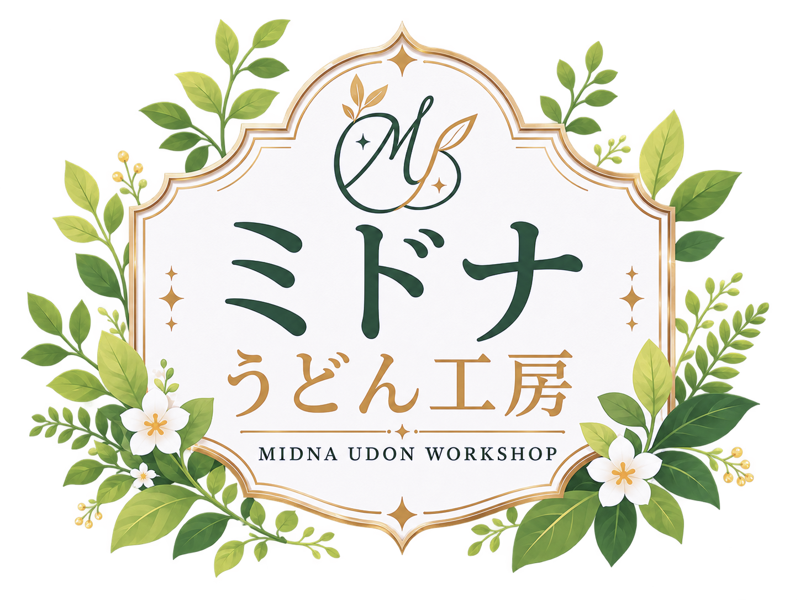

# MidnaUdon EventPhotoSorter

**Ver1.00 / Windows用・イベント写真振り分けアプリ**

参考写真から人物の外見を照合し、イベントで撮った写真を人物ごとのフォルダへ整理します。VRChatなどのイベント運営者向けです。



GitHub（仮URL・公開準備中）：https://github.com/YOUR_GITHUB_ACCOUNT/MidnaUdon-EventPhotoSorter

> このURLは仮です。公開時に `YOUR_GITHUB_ACCOUNT` を実際のアカウント名へ置き換えてください。

## まず使いたい方へ

EXE配布版をフォルダごと展開して、`MidnaUdon EventPhotoSorter.exe` を起動してください。Pythonのインストールは不要です。
一般向けの手順・APIキーの準備・利用上の注意は [Readme.txt](Readme.txt) にまとめています。

1. `参考画像/イベント名/区分/人物名/` に各人物の単独写真を入れます。区分は参加者・スタッフなど任意です。
2. `作業フォルダ` に写真を入れます。**成功した写真は移動するため、初めはコピーした写真で試してください。**
3. フォルダとクラス（イベント名）を選択し、シンプル設定のモード・枚数を指定して開始します。
4. 最初は20枚程度で確認し、枚数を0にすると全件処理します。

```
参考画像/
└─ 交流会/
   ├─ 参加者/
   │  ├─ 人物A/参考.png
   │  └─ 人物B/参考.png
   └─ スタッフ/
      └─ 人物C/参考.png
```

## 判定モード

| モード | 選べる場所 | 動作 |
| --- | --- | --- |
| ローカルのみ（初期値） | シンプル／詳細 | APIキー・API料金不要。複数人数には対応せず、人数・品質の分類はしません。複数人写真が個人フォルダに入る場合があります。 |
| 人物領域ハイブリッド | シンプル／詳細 | 人物領域を照合し、必要な判定にAPIを使用。複数人・大勢・ピンぼけ・品質が怪しい写真を各フォルダへ分類します。 |
| ハイブリッド | 詳細 | ローカルで候補を絞り、曖昧な写真をAPIで確認。ローカルで確定した写真では人数を確認しません。 |
| 固定参考API | 詳細 | 全員の参考画像をAPIへ渡して判定。一括1／2／4枚を選択できます。 |

人物領域の既定値は大勢4人以上、ローカル優先・品質分類・曖昧な品質のAPI確認ON、API同時処理4件。中央の主役が十分大きく端の写り込みが小さい場合は個人へ分類します。自動判定には誤りがあるため、結果をご確認ください。

シンプル設定の入力欄はモード・枚数設定・APIキーのみです。詳細設定の変更値は使わず既定値で実行します。APIキーと枚数は共通です。

## APIキーと画像の送信

人物領域ハイブリッドには、ChatGPTのAPIキーが必要です（各自で発行してください）。正確にはOpenAIの開発者向けAPIキーで、通常のChatGPTの画面に写真を送る方式ではありません。

[OpenAIのAPIキー作成画面](https://platform.openai.com/api-keys)でキーを作成し、アプリへ入力して実行すると、EXEと同じ場所の `.env` に保存して次回から読み込みます。公式の作成手順は [OpenAI Developer quickstart](https://developers.openai.com/api/docs/quickstart) を参照してください。

APIを使うモードでは、判定対象の画像・切り抜き・参考画像と、参考画像フォルダの区分名／人物名に由来する識別子が必要に応じてOpenAIへ送信され、利用料金が発生します。ローカルのみでは判定のための画像をAPIへ送信しません。モデルがない場合の初回取得は別途通信します。送信について必要な権利・許諾を確認し、人物名フォルダに送信に適さない本名や秘密の情報を入れないでください。

APIデータは通常、明示的な共有同意がなければモデル学習に使われませんが、不正利用監視等の保持条件は別です。`store=False`やアプリの記録OFFはゼロ保持を意味しません。[OpenAI公式のデータ管理](https://developers.openai.com/api/docs/guides/your-data)

`.env` は平文です。APIキーや実写真をGitHubへアップロードしないでください。OSに `OPENAI_API_KEY` を設定している場合は起動時にそちらを優先します。キーの保存に失敗した場合は処理を開始しません。

## 出力・詳細設定

成功した写真は `振り分け後/イベント名/区分/人物名/` などへ移動します。人物を確定できない写真・複数人・大勢・人物なし・ピンぼけ・品質要確認は `複数人or未分類/` 内の各フォルダに入ります。処理エラーの元画像は作業フォルダに残します。

詳細設定には、APIモデル・候補数・しきい値・並列数・主役扱い・人数先行判定・参考領域再利用・連写共有・品質判定・手動の人物領域指定・方式比較を用意しています。下の項目は右側のスクロールバーで表示できます。

「判定だけ試す」は写真を移動しませんが、API料金は発生します。「処理記録を保存」は初期OFFです。ONにするとCSV・集計JSON・再開用JSON/SQLiteを保存し、OFFでも画面に進捗・時間・推定料金を表示します。方式比較は記録設定と独立して結果を保存します。モデル／参考領域キャッシュと画面設定は処理記録とは別です。

## ソースから起動する

Windows 10 / 11、64bit Python 3.12での実行を想定しています。初回のモデル取得にインターネット接続が必要です。

```powershell
.\setup.bat
.\start.bat
```

手動の場合：

```powershell
py -3.12 -m venv .venv
.\.venv\Scripts\python.exe -m pip install -r requirements.txt
.\.venv\Scripts\python.exe app.py
```

GUIにもCLIにも、実行時の初期モードとしてローカルのみを使います。

```powershell
.\.venv\Scripts\python.exe -m photo_sorter.cli --references 参考画像/交流会 --output 振り分け後/交流会 --max-files 20
.\.venv\Scripts\python.exe -m photo_sorter.cli --mode regional --references 参考画像/交流会 --output 振り分け後/交流会 --dry-run --save-records
```

## EXEのビルド

```powershell
.\.venv\Scripts\python.exe -m pip install -r requirements-build.txt
.\.venv\Scripts\python.exe tools/download_models.py
.\build_exe.ps1
```

ビルドにはVisual Studio 2022のVC++ x64再配布用CRTが必要です。通常は自動検出します。別のインストール先は `EVENTPHOTOSORTER_VC_REDIST` で `VC/Redist/MSVC/14.x/x64/Microsoft.VC143.CRT` を指定してください。DLL探索先をPython・公式CRT・Windowsに限定し、別アプリのDLLを検出した場合はビルドを停止します。DbgHelp・DbgCore・UCRT・API-setはWindows 10/11標準の部品を使います。

`配布用/MidnaUdon EventPhotoSorter/` は手元で使うフォルダとして更新し、既存の写真やキーを保持します。**この利用済みフォルダをそのまま公開しないでください。** 更新前EXEは `artifacts/exe_backups/` に保存します。

公開に使うのは、新規作成される `公開用/EventPhotoSorter-v1_00-Windows-日時.zip` です。許可したEXE・文書・ライセンス・固定リビジョンのモデルだけを収録し、キー・写真フォルダは空、利用履歴や特徴量キャッシュは除外します。ネイティブ部品の取得元とハッシュは `licenses/native_dependencies.json`、公開ファイル全体は `RELEASE_MANIFEST.json` に記録します。

配布版の初回起動時にMicrosoftランタイムの利用条件を確認します。これは同梱Microsoft部品に適用され、アプリ本体のMITライセンスは変わりません。

GPU版は `setup_gpu.ps1` で対応GPU・CUDA環境を準備し、`build_gpu_exe.ps1` でビルドします。GPU版EXEは親フォルダの写真・キー・モデルを共有します。GPU環境のライセンスも収集して配布してください。

## テスト

```powershell
.\.venv\Scripts\python.exe -m unittest discover -s tests -v
```

APIはモックで検証し、一時フォルダのダミー画像を使用します。GUIテストにはTcl/Tkが必要です。

## GitHub公開用ソースの書き出し

```powershell
.\.venv\Scripts\python.exe tools/export_source.py --init-git
```

`公開用/` に新しいソースフォルダとZIPを作ります。コード・テスト・ビルドスクリプト・ロゴ・Readme・ライセンスを明示的に選んでコピーします。`.git`、過去の履歴、`.env`、写真、モデルの重み、EXE、仮想環境、実験ログは含めません。ファイル別SHA-256は `SOURCE_MANIFEST.json` にあります。

`--init-git` を付けた場合、ZIP作成後に書き出しフォルダだけで初回コミット1件の新規Gitを作ります。開発履歴やリモート設定を引き継がず、ZIPにも`.git`は含めません。初回コミットは作者名MidnaUdonと連絡用ではない`noreply@example.invalid`を使い、開発環境の個人メールアドレスを引き継ぎません。

GitHubにはこの書き出し先の**中身**を新しいリポジトリへアップロードしてください。既存開発フォルダのGit履歴をそのまま公開する手順ではありません。重みやEXEはGitHubのソースファイルへ追加せず、EXE配布は必要に応じてReleases等で扱ってください。

## ライセンス・クレジット

独自ソースコードと文書は [MIT License](LICENSE)。商用利用・改変・再配布・販売を許可します。著作権表示とライセンスを保持してください。

- ブランドロゴ：[ASSET_NOTICE.md](ASSET_NOTICE.md)。ソフトウェアの再配布とロゴ単体の素材利用を区別しています。
- 第三者ライブラリ・モデル：[THIRD_PARTY_NOTICES.md](THIRD_PARTY_NOTICES.md) / [ライセンス一覧](licenses/INDEX.md)。それぞれの原文を同梱しています。
- モデルは [DINOv2-small](https://huggingface.co/facebook/dinov2-small) と [Grounding DINO tiny](https://huggingface.co/IDEA-Research/grounding-dino-tiny)（Apache-2.0）です。

## 作者・連絡先

MidnaUdon / ミドナうどん工房

- [X (Twitter)](https://x.com/Midna_Alfort)
- [BOOTH](https://midna-alfort.booth.pm/)

2026/09/07：Ver1.00。シンプル設定・APIキー保存・任意の記録保存・工房ロゴに対応。
